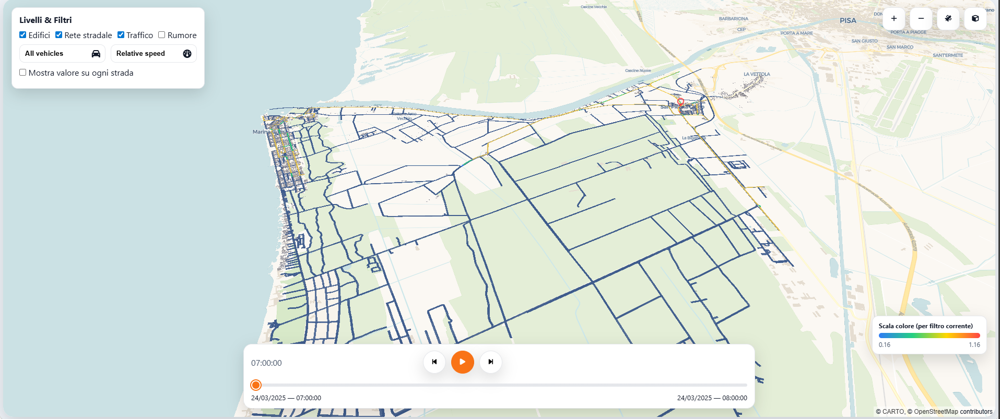
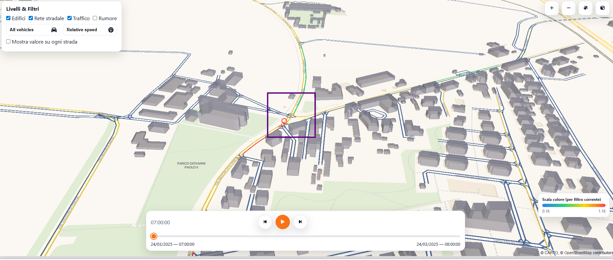
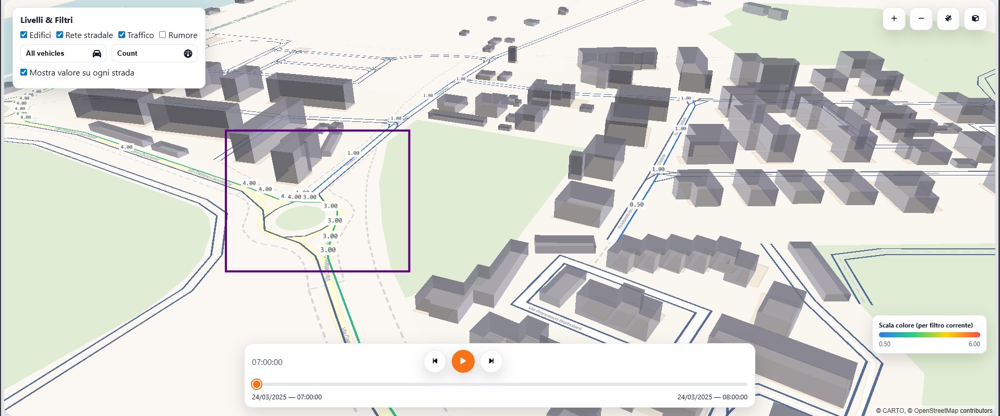

# 🗺️ Pisa Traffic & Urban Map

An **interactive  app** exploring traffic patterns, road networks, and urban infrastructure in Pisa through a comprehensive local data pipeline.

## 🎯 Overview

This project showcases an end-to-end data visualization system that transforms raw urban data into an interactive map experience using:

- 🧠 **Backend**: Python: NiceGUI 
- 🗂️ **Data**: Parquet files + GeoJSON APIs  
- 🌍 **Frontend**: MapLibre GL + deck.gl

## ✨ Key Features

- **Interactive Traffic Analysis**
    - Real-time visualization with timeline controls
    - Vehicle class filtering (trucks, cars, mopeds etc.)
    - Multiple metrics: count, speed, relative speed
    - Peak traffic highlighting

- **Urban Infrastructure**
    - 3D building visualization
    - Detailed road network
    - Satellite imagery integration
    - Toggleable map layers

## 🛠️ Technical Architecture 

### Backend Pipeline
1. Loads Parquet datasets (roads, buildings, traffic)
2. Processes geometries 
3. Computes traffic metrics and statistics
4. Serves data via GeoJSON APIs

### Frontend Visualization
- Responsive MapLibre GL base map
- deck.gl data layers
- Interactive controls and filters
- Dynamic styling and updates

## 📊 Data Sources

| Dataset | Content |
|---------|---------|
| Roads | Network geometries, attributes |
| Buildings | Footprints, height data |
| Traffic | Time-series flow data |


## 📂 Project Structure


```text
.
├─ main.py                        # Entry point: starts NiceGUI app and mounts APIs/static
├─ server/
│   ├─ __init__.py               # Marks `server` as a package
│   ├─ app_config.py             # Paths, constants, CRS config
│   ├─ data_loaders.py           # Load parquet data into DataFrames
│   ├─ geometry_utils.py         # Reprojection + GeoJSON helpers
│   ├─ traffic_processing.py     # Traffic metrics and cached traffic frames
│   ├─ roads_cache.py            # Cached road geometries as GeoJSON + index
│   └─ api_endpoints.py          #  NiceGUI routes for buildings/roads/traffic/meta
├─ data/
│   ├─ BUILDINGS_GEOM_v1.parquet
│   ├─ GEOM_V1.parquet
│   └─ traffic_res.parquet
├─ static/
│   ├─ map_deck.html             # Frontend (MapLibre + deck.gl UI)
│   ├─ map.css                   # Styles
│   └─ map.js                    # JS logic (map, layers, timeline, controls)
└─ notebooks/
    └─ 01_exploratory_traffic.ipynb   # EDA used to design transformations


## 🔗 API Reference

| Endpoint | Description |
|----------|-------------|
| `/api/map/buildings` | Building geometries |
| `/api/map/roads` | Road network |
| `/api/map/traffic` | Traffic data frames |


## 🚀 Getting Started

1. **Setup Environment**
```bash
python -m venv .venv
source .venv/bin/activate  # or .venv\Scripts\activate on Windows
pip install -r requirements.txt
```

2. **Launch App**
```bash
python main.py
```

3. Visit `http://localhost:8080`


## 📸 Screenshots


*Interactive map with traffic visualization*


*Peak traffic patterns and road segments*



*Values per Road Segment – numeric values rendered on roads.*


*Building Information Popup – example of building attributes (height, population).*


    

